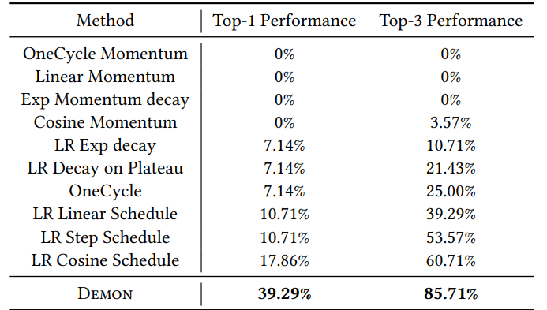
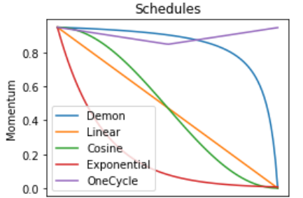

# [Demon : Improved Neural Network Training with Momentum Decay](https://arxiv.org/abs/1910.04952)

John Chen, Cameron Wolfe, Zhao Li, Anastasios Kyrillidis ; 2021

```bibtex
@misc{https://doi.org/10.48550/arxiv.1910.04952,
  doi = {10.48550/ARXIV.1910.04952},
  
  url = {https://arxiv.org/abs/1910.04952},
  
  author = {Chen, John and Wolfe, Cameron and Li, Zhao and Kyrillidis, Anastasios},
  
  keywords = {Machine Learning (cs.LG), Image and Video Processing (eess.IV), Optimization and Control (math.OC), Machine Learning (stat.ML), FOS: Computer and information sciences, FOS: Computer and information sciences, FOS: Electrical engineering, electronic engineering, information engineering, FOS: Electrical engineering, electronic engineering, information engineering, FOS: Mathematics, FOS: Mathematics},
  
  title = {Demon: Improved Neural Network Training with Momentum Decay},
  
  publisher = {arXiv},
  
  year = {2019},
  
  copyright = {arXiv.org perpetual, non-exclusive license}
}
```

## Notes
* Decaying momentum (Demon) is a momentum scheduling rule that aims to improve model performance. Model performance is affected by the 
  hyperparameters. Learning rate and momentum scheduling affect the process of hyperparameter tuning. 
* The momentum decay schedule mentioned is $$ β_t = β_{init} \frac{\left(1 - \frac{t}{T}\right)}{(1 - β_{init}) + β_{init} \left(1 - \frac{t}{T}\right)} $$
* SGD and Adam with Demon incorporated into them is given below


  
* The implementation of Demon in common optimization algorithms does not involve much additional effort. 
* Demon was tested against a variety of different tasks. It was generally found that Demon is resilient to hyperparameter tuning, as compared to other momentum schedules (including step, cosine, OneCycle, linear, exponential and decay on plateau). Momentum schedules and their overall performance in the 28 tests conducted are given below


Some of the main results are given below
* On LSTMs, Demon performed worse than step schedules (step, decay on plateau, cosine)
* On image tasks (using residual networks), Demon achieved top 3 performances when compared to other schedules
* For $\text{BERT}_{BASE}$ - GLUE, Demon Adam performed marginally better than Adam with a learning rate step schedule.