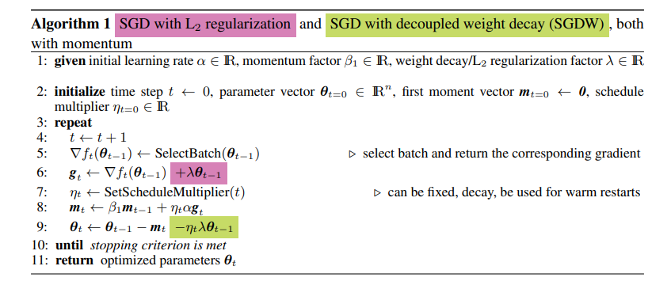
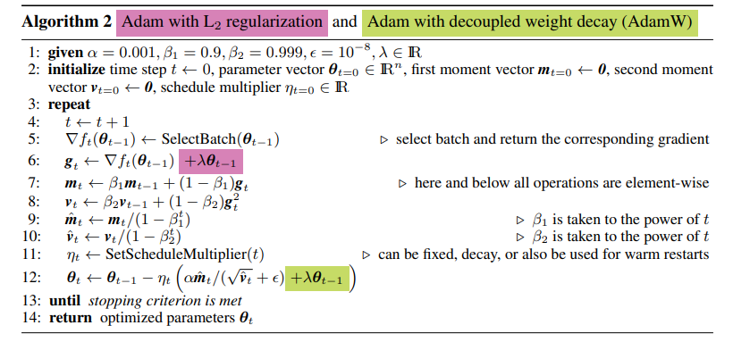

# [Decoupled Weight Decay Regularization](https://arxiv.org/pdf/1711.05101.pdf)
Ilya Loshchilov,  Frank Hutter; 2017

```bibtex
@article{DBLP:journals/corr/abs-1711-05101,
  author    = {Ilya Loshchilov and
               Frank Hutter},
  title     = {Fixing Weight Decay Regularization in Adam},
  journal   = {CoRR},
  volume    = {abs/1711.05101},
  year      = {2017},
  url       = {http://arxiv.org/abs/1711.05101},
  eprinttype = {arXiv},
  eprint    = {1711.05101},
  timestamp = {Mon, 13 Aug 2018 16:48:18 +0200},
  biburl    = {https://dblp.org/rec/journals/corr/abs-1711-05101.bib},
  bibsource = {dblp computer science bibliography, https://dblp.org}
}
```

## Notes
* Weight decay in SGD is basically L2 regularization with a reparameterization of the weight decay factor based on the learning
rate ($λ^`=λ/α$)

 

* But this is not the same in case of Adam, as L2 regularization makes the weight decay normalized by the $sqrt(v)$ term, which causes the weight to be  regularized less than weights with small and slowly changing gradients.
* As a solution, in AdamW, the weight decay term is decoupled, where the weight decay is performed only after controlling the parameter-wise step size.
* AdamW yields better training loss and that the models generalize much better than models trained with Adam allowing the new version to compete with stochastic gradient descent with momentum. 



