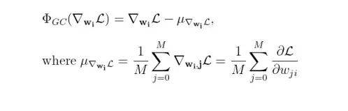
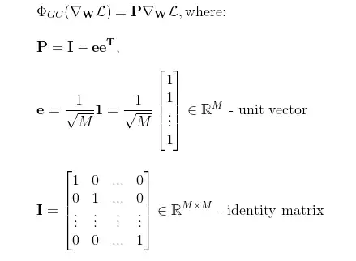
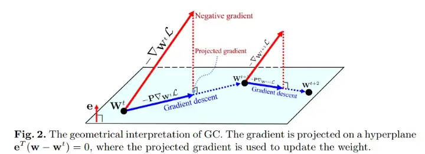

# [Gradient Centralization: A New Optimization Technique for Deep Neural Networks](https://arxiv.org/pdf/2004.01461.pdf)
Hongwei Yong, Jianqiang Huang; 2020

```bibtex
@article{DBLP:journals/corr/abs-2004-01461,
  author    = {Hongwei Yong and
               Jianqiang Huang and
               Xiansheng Hua and
               Lei Zhang},
  title     = {Gradient Centralization: {A} New Optimization Technique for Deep Neural
               Networks},
  journal   = {CoRR},
  volume    = {abs/2004.01461},
  year      = {2020},
  url       = {https://arxiv.org/abs/2004.01461},
  eprinttype = {arXiv},
  eprint    = {2004.01461},
  timestamp = {Tue, 14 Apr 2020 17:31:04 +0200},
  biburl    = {https://dblp.org/rec/journals/corr/abs-2004-01461.bib},
  bibsource = {dblp computer science bibliography, https://dblp.org}
}
```

## Notes

* Gradient centralization (GC) operates directly on gradients by centralizing the gradient vectors to have zero mean.  

  

* Mean value of gradients from each column is subtracted from the column, so that the mean of gradients in a column will be zero. 



* Alternatively, 

  

* GC can be viewed as a projected gradient descent method with a constrained loss function.

  
* This constraint on the weight vectors regularizes the solution space of w leading to better generalization capacities of a trained model.
  
    


**Theorem:**   
>Suppose that SGD (or SGDM) with GC is used to update the weight vector $w$, for any input feature vectors $x$ and $x + γ1$, we have,  
>$(w^t)^T x − (w^t)^T (x + γ1) = γ1^Tw^0$
>
>where $w^0$ is the initial weight vector and $γ$ is a scalar.<br>

* if the mean of $w^0$ is close to zero, then the output activation is not sensitive to the intensity change of input features, and the output feature space becomes more robust to training sample variations. 
* Because of the contrained loss function, the optimization landscape can be smoother for faster and more effective training.


