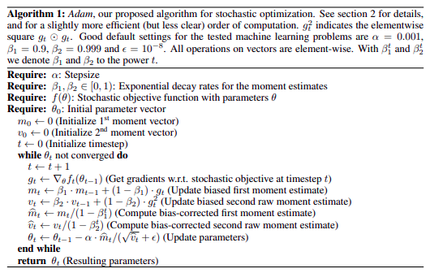

# [Adam: A method for stochastic optimization](https://arxiv.org/pdf/1412.6980.pdf)
Diederik P. Kingma, Jimmy Ba; 2014

```bibtex
@inproceedings{DBLP:journals/corr/KingmaB14,
  author    = {Diederik P. Kingma and
               Jimmy Ba},
  editor    = {Yoshua Bengio and
               Yann LeCun},
  title     = {Adam: {A} Method for Stochastic Optimization},
  booktitle = {3rd International Conference on Learning Representations, {ICLR} 2015,
               San Diego, CA, USA, May 7-9, 2015, Conference Track Proceedings},
  year      = {2015},
  url       = {http://arxiv.org/abs/1412.6980},
  timestamp = {Thu, 25 Jul 2019 14:25:37 +0200},
  biburl    = {https://dblp.org/rec/journals/corr/KingmaB14.bib},
  bibsource = {dblp computer science bibliography, https://dblp.org}
}
```

## Notes

* We introduce Adam, an algorithm for first-order gradient-based optimization of stochastic objective functions, based on adaptive estimates of lower-order moments

* The method is straightforward to implement, is computationally efficient, has little memory requirements, is invariant to diagonal rescaling of the gradients, and is well suited for problems that are large in terms of data and/or parameters

* We analyze the theoretical convergence properties of the algorithm and provide a regret bound on the convergence rate that is comparable to the best known results under the online convex optimization framework

* Empirical results demonstrate that Adam works well in practice and compares favorably to other stochastic optimization methods

